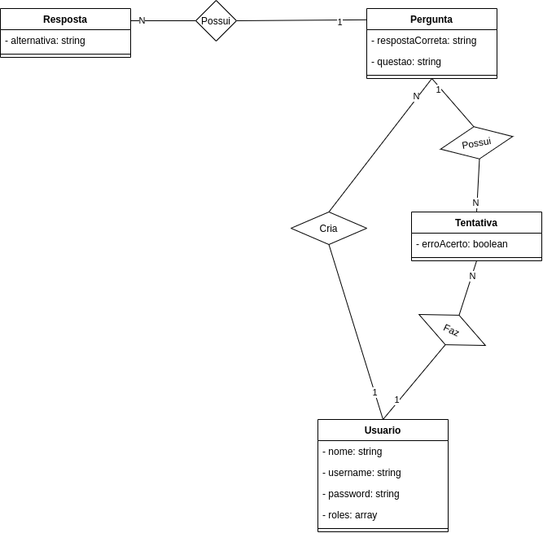
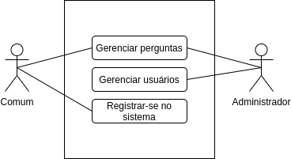

# RootQuiz_SymfonyRestAPI
Um web app para fins de estudo. O objeto de aprendizagem foi o framework php Symfony: Foi construída uma API Rest. Formulei um cenário com 2 níveis de acesso e quatro entidades.

### Tecnologias
##### REST [[Link do Repo]](https://github.com/gabrielroot/RootQuiz_SymfonyRestAPI)
- PHP 7.4
- PostgreSql
- Symfony 5.3
    1. Doctrine
    2. Security -> User
    3. Security -> Acess Control

	
#### Front [[Link do Repo]](https://github.com/gabrielroot/RootQuiz_RactFront)
- React
    1. Styled-Components
    2. Axios
    3. Semantic-UI

## Diagramas
### Diagrama de Classes

### Login

## Capturas
### Login

### Quiz

### Admin

### Edit

